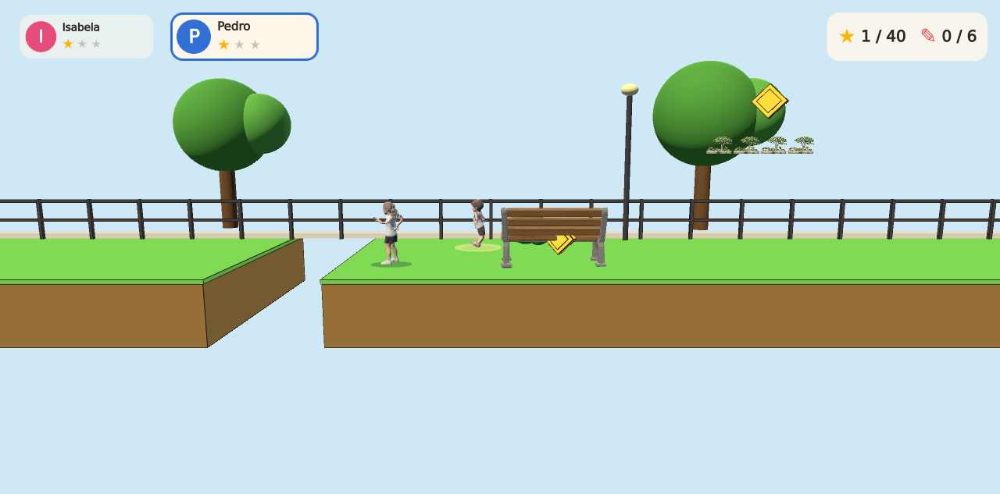
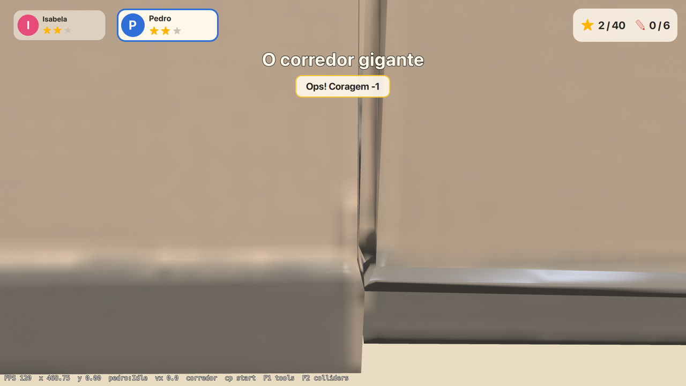

# Isabela & Pedro: A Escola Virou Aventura

**Um platformer 2.5D para navegador e desktop, feito com Clayground; assets criados no QtMeshEditor.**

Dois irmãos, Isabela e Pedro, esperam na pracinha em frente à escola. Quando o sinal toca, a
imaginação transforma o caminho até a sala de aula em uma aventura: os equipamentos de ginástica
ficam enormes, o portão parece distante, o playground vira um desafio vertical e o corredor cresce
como um labirinto. O ambiente é 3D, a movimentação acontece num plano lateral.

> **Status: MVP jogável** - a fase "O Caminho para a Sala" (pracinha → jardim → playground → pátio →
> quadra → corredor → porta da sala), dois personagens com habilidades próprias, troca de personagem,
> IA de companheiro, Coragem, 4 checkpoints, 40 estrelas, 6 lápis, 1 Memória da Família, salvamento,
> teclado e gamepad. A escola é fictícia ("Escola Horizonte").




## Requisitos

| Ferramenta | Versão | Observações |
|---|---|---|
| Qt | **6.10.0 ou mais novo** (desenvolvido com 6.11.1) | Clayground exige 6.10+. Kit desktop com Qt Quick 3D, Quick 3D Physics (dependência do Clayground), Quick Timeline, Multimedia, Shader Tools. Para a web: o kit `wasm_multithread` da mesma versão. |
| Emscripten | **exatamente a versão que o seu Qt pede** (4.0.7 para Qt 6.11) | `grep QT_EMCC_VERSION <kit wasm>/mkspecs/qconfig.pri` |
| CMake ≥ 3.25, Ninja, Python 3, Node 22 | | Node só para `tests/run-node.mjs` |
| QtMeshEditor | 3.37+ | apenas para (re)gerar assets; não é necessário para compilar ou jogar |

```bash
python3 -m aqt install-qt mac desktop 6.11.1 clang_64 -O ~/Qt \
    -m qtquick3d qtquick3dphysics qtquicktimeline qtmultimedia qtshadertools
python3 -m aqt install-qt all_os wasm 6.11.1 wasm_multithread -O ~/Qt \
    -m qtquick3d qtquicktimeline qtmultimedia qtshadertools
git clone https://github.com/emscripten-core/emsdk.git ~/emsdk-qt6
~/emsdk-qt6/emsdk install 4.0.7 && ~/emsdk-qt6/emsdk activate 4.0.7
```

## Compilar e executar

```bash
git clone --recursive https://github.com/fernandotonon/Isabela-Pedro-A-Escola-Virou-Aventura.git escola-aventura
cd escola-aventura
git submodule update --init --recursive       # se esqueceu o --recursive

# Desktop
export QT_ROOT=~/Qt/6.11.1/macos
cmake --preset desktop && cmake --build --preset desktop --target escola_aventura
./build-desktop/bin/escola_aventura.app/Contents/MacOS/escola_aventura     # macOS
ctest --preset desktop -R "escola|Escola|physics|rules"                     # testes do jogo (headless)
node tests/run-node.mjs                                                     # checagens rápidas sem Qt

# WebAssembly + diretório estático para publicar
scripts/build-wasm.sh                 # -> deploy/multithread/
python3 scripts/serve.py deploy/multithread
open http://localhost:8080/
```

Clayground é um submódulo git (`external/clayground`) compilado junto; não há nada para instalar.
Se o CMake pegar um Qt errado (ex.: Homebrew em `/usr/local`), os presets já passam
`-DCMAKE_IGNORE_PREFIX_PATH=/usr/local`. Em Apple Silicon o preset fixa `CMAKE_OSX_ARCHITECTURES=arm64`
e `OPENSSL_ROOT_DIR=/opt/homebrew/opt/openssl` (dependência de rede do Clayground).

Dicas de máquina local ficam num `CMakeUserPresets.json` (ignorado pelo git) herdando de `desktop`,
por exemplo `FETCHCONTENT_SOURCE_DIR_LLAMA_CPP` apontando para um checkout já existente do llama.cpp
(o plugin `clay_ai` do Clayground o baixa no configure). Compile o alvo `escola_aventura` em vez de
`all` se o caminho do projeto tiver `&` ou espaços: o alvo de exemplos do qml-box2d não escapa o
caminho corretamente.

Linha de comando: `--autotest` (passeio roteirizado curto, imprime linhas `AUTOTEST`; `--shots <dir>` salva
capturas), `--walkthrough` (joga a fase inteira com o roteiro de `app/config/walkthrough.js` e sai com código 0
quando a porta da sala se abre - a prova executável de que a fase é completável; a rota completa leva ~3 min de
tempo de jogo e roda mais rápido que o tempo real), `--no-models` (placeholders),
`--no-dev` (desliga as ferramentas de desenvolvimento). No navegador: `index.html?args=--autotest`.

## Controles

| Teclado | Gamepad | Ação |
|---|---|---|
| A / D, ← → | analógico / D-pad | mover (segure para correr) |
| Espaço | A / ✕ | pular (segure para pular mais alto) |
| E | X / □ | interagir (alavanca, porta final) |
| Q, Tab | Y / △, LB / RB | trocar de personagem |
| Shift | B / ○ | habilidade especial (caderno da Isabela, curiosidade do Pedro) |
| S / ↓ | ▼ | abaixar e passar por baixo (Pedro) |
| Esc / P | Start | pausar |
| F1 / F2 | | ferramentas de desenvolvimento / colliders (apenas builds de desenvolvimento) |

Gamepads físicos são lidos pela Gamepad API do navegador (mapeamento padrão W3C) na build web.
O Qt 6 não tem módulo de gamepad para desktop, então no computador use o teclado. Em celulares e
tablets, o gamepad virtual do Clayground é ativado automaticamente ao tocar na tela.

## Layout do repositório

```
app/            QML do jogo (Main.qml entrada, EscolaGame.qml raiz, sistemas em arquivos separados,
                scripts/*.js módulos puros, config/*.js manifesto de assets, fase, strings, tuning,
                src/ SaveStore + GamepadBridge em C++)
assets/         source-images → exported (GLB) → rigged (GLB) → runtime (balsam .mesh/.qad + QML),
                sprites (folhas renderizadas pelo QtMeshEditor), audio (sintetizado)
scripts/        generate-models.sh · rig-character.sh · render-sprites.sh · import-runtime.py ·
                update-asset-manifest.py · gen-audio.py · build-wasm.sh · serve.py · deploy-pages.sh
tests/          suítes QML (ctest) + run-node.mjs (as mesmas regras, sem Qt)
docs/           arquitetura, pipeline de assets, troca de assets, publicação
external/       submódulo Clayground
web-runtime/    Main.qml para o Clayground Web Runtime pré-compilado (sem toolchain local)
```

## Assets: pipeline em uma linha cada

```bash
scripts/generate-models.sh pedro           # imagem -> GLB (TRELLIS.2 via QtMeshEditor)
scripts/rig-character.sh pedro             # -> GLB com esqueleto humanoide + clipes Idle/Walk/Run/Jump/...
python3 scripts/import-runtime.py assets/rigged/pedro/pedro_rigged.glb assets/runtime/pedro --name Pedro
scripts/render-sprites.sh school_bench     # -> assets/sprites/school_bench.png (turntable, 8 quadros)
python3 scripts/update-asset-manifest.py   # aponta app/config/assets.js para o que existe
```

Trocar um placeholder por um modelo real (ou por uma sprite sheet) é uma edição do manifesto
`app/config/assets.js`; a lógica da fase não muda. Detalhes em [`docs/asset-pipeline.md`](docs/asset-pipeline.md)
e [`docs/architecture.md`](docs/architecture.md).

## Publicação web

A build WebAssembly é multithread (necessário para Qt Quick 3D), então a página precisa ser
*cross-origin isolated*: envie `Cross-Origin-Opener-Policy: same-origin` e
`Cross-Origin-Embedder-Policy: require-corp`, ou - no GitHub Pages, que não define cabeçalhos - mantenha
o `coi-serviceworker.js` empacotado. `.wasm` deve ser servido como `application/wasm`. Abrir o
`index.html` do disco não funciona. `scripts/deploy-pages.sh` publica `deploy/multithread` no branch
`gh-pages` (mesmo processo usado no Ironfang).

## Limitações conhecidas

* **Áudio na web**: criar os objetos `Clayground.Sound` congela a página na build WebAssembly (o desktop
  tem áudio completo). A build web roda em silêncio por padrão; `index.html?args=--audio` ativa o áudio
  para testar quando o Clayground corrigir o problema (issue MisterGC/clayground#216).
* **Preset `high` do TRELLIS.2**: nesta máquina (24 GB) os presets `high`/`balanced` travam num command
  buffer do Metal; `scripts/generate-models.sh` detecta o travamento e usa `fast` (512). Os limites de
  triângulos (10k props / 25k personagens) e texturas (1024 / 2048) são respeitados em qualquer preset.
* **Gamepad no desktop**: o Qt 6 não tem módulo de gamepad; controles físicos funcionam na build web.
* **Sprites**: a troca modelo → sprite sheet está implementada (`representation: "sprite"` no manifesto e
  `scripts/render-sprites.sh`); as folhas dos props são geradas pelo pipeline, as animadas dos personagens
  (`--animated`) ficam como próximo passo.

## Licença

MIT (código e dados do jogo). Qt Quick 3D é GPL-3.0 na edição open source, compatível com MIT para o
código do jogo; ao hospedar a build, mantenha `LICENSES/`. Veja [`THIRD_PARTY_LICENSES.md`](THIRD_PARTY_LICENSES.md).
